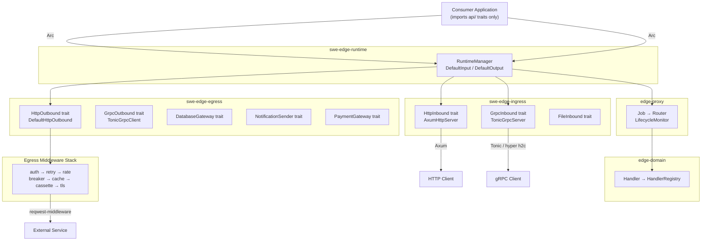
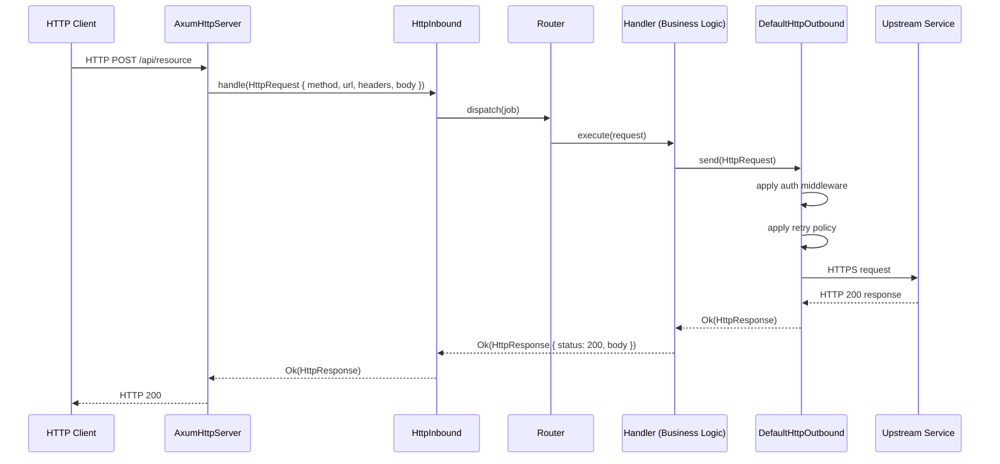
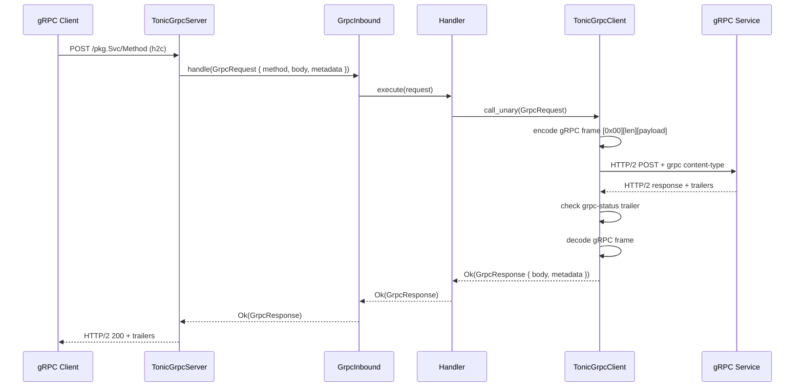

# Edge Architecture

**Audience**: Developers, architects

## Stakeholders & Concerns

> Per ISO/IEC/IEEE 42010:2022

| Stakeholder | Concerns |
|-------------|----------|
| Application developers | Port trait stability, factory API ergonomics, no framework lock-in |
| Library authors | Composable middleware, trait-only public surface, SEA contract |
| Platform engineers | Graceful shutdown, systemd notify, health checks, observability |
| Architects | Layer separation, dependency direction, cross-workspace boundaries |

## TLDR

Edge is a five-workspace, library-level Rust dispatch stack. Each workspace is an independent SEA-compliant crate group (`api/` → `core/` → `saf/`). Consumer code imports only traits from `api/` and calls factories from `saf/` — no Axum, Tonic, or reqwest types cross the boundary. The transport is swappable without touching business logic.

## What

Edge provides embeddable, production-grade HTTP/gRPC dispatch for Rust services without a sidecar process. It enforces the SEA (Structural Engineering Architecture) module contract at the type level across five peer workspaces: `ingress/`, `egress/`, `proxy/`, `domain/`, and `runtime/`.

## Who

| Stakeholder | Concerns |
|-------------|----------|
| Application developers | Port traits, factory APIs, no framework lock-in |
| Library authors | Composable middleware, trait-only public surface |
| Platform engineers | Graceful shutdown, systemd notify, health checks |
| Architects | Layer separation, dependency direction, module boundaries |

## Why

Infrastructure proxies (Envoy, Traefik) require a sidecar process — unacceptable for embedded or resource-constrained deployments. Framework-coupled code (Axum types in domain logic, Tonic stubs in business code) is hard to test and impossible to transport-swap. Edge enforces the boundary at the type level so the transport is always behind the trait.

## How

Consumer code calls a `saf/` factory (e.g., `saf::http_server(addr, handler)`) returning `impl Trait`. The factory constructs the concrete server (`AxumHttpServer`, `TonicGrpcServer`) inside `core/` and returns it through the public trait. The application only ever holds a `dyn HttpInbound` or `dyn HttpOutbound` — the concrete type never leaks.

---

## Block Diagram



---

## Dataflow Diagram

```mermaid
graph LR
    C["Client"] -->|"HTTP/gRPC request"| T

    subgraph ingress_layer["Ingress Layer"]
        T["AxumHttpServer\nTonicGrpcServer"]
        T -->|"HttpRequest\nGrpcRequest"| H["HttpInbound.handle()\nGrpcInbound.handle()"]
    end

    subgraph domain_layer["Domain Layer"]
        H -->|"job dispatch"| R["Router"]
        R -->|"handler id"| HR["HandlerRegistry"]
        HR -->|"execute"| BL["Business Logic\n(Handler impl)"]
    end

    subgraph egress_layer["Egress Layer"]
        BL -->|"HttpRequest"| HO["DefaultHttpOutbound"]
        HO -->|"auth→retry→rate\nbreaker→cache"| reqwest["reqwest-middleware"]
        reqwest -->|"HTTPS / h2c"| US["Upstream Service"]
        US -->|"HTTP Response"| reqwest
        reqwest -->|"HttpResponse"| HO
        HO -->|"HttpResponse"| BL
    end

    BL -->|"HttpResponse\nGrpcResponse"| H
    H -->|"response"| T
    T -->|"HTTP/gRPC response"| C
```



---

## Sequence Diagram — HTTP Request



---

## Sequence Diagram — gRPC Unary Call



---

## SEA Module Layout

Every crate in every workspace follows this layout:

```
src/
├── api/       # Public traits and value objects — all pub trait declarations
├── core/      # Implementations — pub(crate) only, never exposed directly
├── saf/       # Service Abstraction Framework — sole public factory surface
├── spi.rs     # Extension hooks for downstream consumers (optional)
└── lib.rs     # pub use saf::*
```

### Dependency Rules

- **saf/** depends on `api/` and `core/` (constructs concrete types, returns `impl Trait`)
- **api/** depends on nothing (leaf layer — only std + serde types)
- **core/** depends on `api/` (implements traits declared there)
- Consumers depend only on `saf/` — they never name `core/` types

### Cross-Workspace Dependencies

```
runtime
  └── depends on → ingress (api/ traits: HttpInbound, GrpcInbound, FileInbound)
  └── depends on → egress  (api/ traits: HttpOutbound, GrpcOutbound, DatabaseGateway, ...)
  └── depends on → proxy   (api/ traits: LifecycleMonitor, Router)
  └── depends on → domain  (api/ traits: Handler, HandlerRegistry)

egress/http
  └── depends on → egress/auth, egress/retry, egress/rate, egress/breaker,
                   egress/cache, egress/cassette, egress/tls  (middleware stack)

proxy
  └── depends on → domain  (Handler, HandlerRegistry)
```

---

## Workspace Structure

```
edge/
├── ingress/
│   ├── Cargo.toml              # workspace root
│   ├── main/                   # swe-edge-ingress — re-exports all ingress crates
│   ├── http/                   # swe-edge-ingress-http — HttpInbound + AxumHttpServer
│   ├── grpc/                   # swe-edge-ingress-grpc — GrpcInbound + TonicGrpcServer
│   ├── file/                   # swe-edge-ingress-file — FileInbound trait
│   └── tls/                    # swe-edge-ingress-tls — TLS config value objects
│
├── egress/
│   ├── Cargo.toml              # workspace root
│   ├── main/                   # swe-edge-egress — re-exports all egress crates
│   ├── http/                   # swe-edge-egress-http — HttpOutbound + DefaultHttpOutbound
│   ├── grpc/                   # swe-edge-egress-grpc — GrpcOutbound + TonicGrpcClient
│   ├── database/               # swe-edge-egress-database — DatabaseGateway (postgres/mysql/sqlite)
│   ├── file/                   # swe-edge-egress-file — FileOutbound trait
│   ├── notification/           # swe-edge-egress-notification — NotificationSender (email/tauri)
│   ├── payment/                # swe-edge-egress-payment — PaymentGateway (stripe)
│   ├── auth/                   # swe-edge-egress-auth — Bearer/Basic/ApiKey/AwsSigV4 middleware
│   ├── retry/                  # swe-edge-egress-retry — exponential backoff + jitter
│   ├── rate/                   # swe-edge-egress-rate — token-bucket rate limiter
│   ├── breaker/                # swe-edge-egress-breaker — circuit breaker
│   ├── cache/                  # swe-edge-egress-cache — response cache
│   ├── cassette/               # swe-edge-egress-cassette — record/replay for tests
│   └── tls/                    # swe-edge-egress-tls — mTLS client certificate middleware
│
├── proxy/
│   └── src/                    # edge-proxy — Job, Router, LifecycleMonitor
│
├── domain/
│   └── src/                    # edge-domain — Handler, HandlerRegistry, HandlerError
│
└── runtime/
    └── main/                   # swe-edge-runtime — RuntimeManager, DefaultInput, DefaultOutput
```

---

## Key Types

### Ingress

| Type | Kind | Location |
|------|------|----------|
| `HttpInbound` | `pub trait` | `ingress/http/src/api/` |
| `GrpcInbound` | `pub trait` | `ingress/grpc/src/api/` |
| `FileInbound` | `pub trait` | `ingress/file/src/api/` |
| `HttpRequest` / `HttpResponse` | value objects | `ingress/http/src/api/` |
| `GrpcRequest` / `GrpcResponse` | value objects | `ingress/grpc/src/api/` |
| `AxumHttpServer` | `pub struct` (via `saf/`) | `ingress/http/src/core/` |
| `TonicGrpcServer` | `pub struct` (via `saf/`) | `ingress/grpc/src/core/` |

### Egress

| Type | Kind | Location |
|------|------|----------|
| `HttpOutbound` | `pub trait` | `egress/http/src/api/` |
| `GrpcOutbound` | `pub trait` | `egress/grpc/src/api/` |
| `DatabaseGateway` | `pub trait` | `egress/database/src/api/` |
| `NotificationSender` | `pub trait` | `egress/notification/src/api/` |
| `PaymentGateway` | `pub trait` | `egress/payment/src/api/` |
| `DefaultHttpOutbound` | `pub struct` (via `saf/`) | `egress/http/src/core/` |
| `TonicGrpcClient` | `pub struct` (via `saf/`) | `egress/grpc/src/core/` |

### Runtime

| Type | Kind | Location |
|------|------|----------|
| `RuntimeManager` | `pub trait` | `runtime/main/src/api/` |
| `Input` | `pub trait` | `runtime/main/src/api/` |
| `Output` | `pub trait` | `runtime/main/src/api/` |
| `DefaultInput` | `pub struct` (via `saf/`) | `runtime/main/src/core/` |
| `DefaultOutput` | `pub struct` (via `saf/`) | `runtime/main/src/core/` |

---

## HTTP Middleware Pipeline

`DefaultHttpOutbound` assembles the middleware stack at construction time via `reqwest-middleware`. Each middleware crate is independent and opt-in:

```
Request
  │
  ▼ swe-edge-egress-auth      — injects Authorization header (Bearer / Basic / ApiKey / AWS SigV4)
  ▼ swe-edge-egress-retry     — retries on 5xx / network error with exponential backoff + jitter
  ▼ swe-edge-egress-rate      — token-bucket: enforces requests-per-second limit
  ▼ swe-edge-egress-breaker   — circuit breaker: open after N failures, half-open after timeout
  ▼ swe-edge-egress-cache     — returns cached response on cache hit; stores on miss
  ▼ swe-edge-egress-cassette  — in test mode: plays back recorded response; records on miss
  ▼ swe-edge-egress-tls       — attaches mTLS client certificate
  │
  ▼ reqwest (transport)
  │
Upstream
```

Policy for every middleware is loaded from TOML config — never hardcoded in Rust.

---

## Architectural Viewpoints

| Viewpoint | Diagram | Key Concern |
|-----------|---------|-------------|
| Structural | Block Diagram | Workspace boundaries and layer ownership |
| Behavioral | Dataflow Diagram | Request path through ingress → domain → egress |
| Interaction | Sequence Diagrams (HTTP, gRPC) | Protocol-level contract between components |
| Deployment | Workspace Structure | Independent compilation units, no root workspace |

---

## Cross-Cutting Concerns

### Security

- Secrets are never stored as Rust literals; config reads from environment variables at runtime
- `#![deny(unsafe_code)]` is enforced at the workspace level across all five workspaces
- mTLS is available for both ingress (`swe-edge-ingress-tls`) and egress (`swe-edge-egress-tls`)
- Error messages do not expose internal details to callers; `HttpInboundError` maps to HTTP status codes

### Error Handling

- Every fallible function returns `Result<T, DomainError>` — no panics in library code
- Each workspace defines its own error enum in `src/api/error.rs`; errors never cross workspace boundaries raw
- The `?` operator propagates errors up to the transport layer, which maps them to HTTP/gRPC status codes

### Performance

- All server and client implementations are async via Tokio; no blocking I/O on the runtime thread pool
- `DefaultHttpOutbound` assembles the middleware stack once at construction time (zero overhead per request)
- Port-0 integration tests measure real connection latency; no simulated delays

---

## Key Design Decisions

| Decision | Choice | Rationale |
|----------|--------|-----------|
| No root Cargo workspace | Five independent peer workspaces | Consumers add only the crates they need; no forced transitive compile of unused transport layers |
| `saf/` as sole public surface | Factory returns `impl Trait`; core types `pub(crate)` | Consumers never name concrete structs; transports are swappable without API break |
| TOML-only middleware policy | Config loaded at startup; no Rust literals | Policy changes without recompile; same binary ships to all environments |
| No mocking framework | Stub implementations in test files | Integration tests use real listeners (port 0); unit tests use direct struct construction |
| reqwest-middleware for egress | Composable middleware stack | Each middleware crate is independent; stack assembled at `DefaultHttpOutbound` construction |

---

## Integration Points

| System | Integration | Notes |
|--------|-------------|-------|
| Axum | `AxumHttpServer` wraps Axum router | Transport lives in `core/`; never exposed to consumers |
| Tonic | `TonicGrpcServer` / `TonicGrpcClient` | gRPC over h2c; metadata propagation via `GrpcRequest` |
| reqwest-middleware | `DefaultHttpOutbound` middleware stack | All seven egress middleware crates implement `reqwest_middleware::Middleware` |
| systemd | `sd_notify(READY=1)` / `sd_notify(STOPPING=1)` | Activated when `SD_NOTIFY_SOCKET` env var is set |
| Tokio | Async runtime throughout | All port trait methods return `BoxFuture`; all tests use `#[tokio::test]` |

---

## Related Documents

- [Developer Guide](../4-development/developer_guide.md)
- [Setup Guide](../4-development/setup_guide.md)
- [Testing Strategy](../5-testing/testing_strategy.md)
- [Deployment Guide](../6-operations/deployment_guide.md)
- [Compliance Checklist](compliance/compliance_checklist.md)
